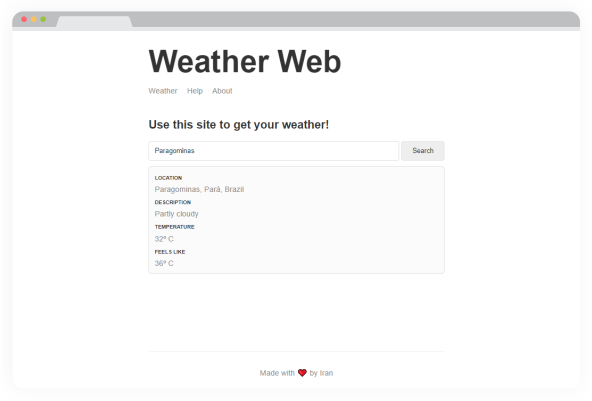

<h1 align="center">Weather Web</h1>
 
## Sobre  

Aplicação desenvolvida para ver informações básicas sobre o clima. A partir de um localização pesquisada a API do [MapBox](https://www.mapbox.com/) devolve a latitude e longitude que é passada para a API [weatherstack.com](https://weatherstack.com/) que entrega as informações climáticas.

## Tecnologias  

Criado com:  

- [x] **Node.js** 
- [x] **Express**   
- [x] **Handlebars**  
  

## Resultados  
<p align="center"></p>

## Execute a aplicação  

```sh  
#Instale as dependências  
$ npm install  
  
#Inicie a aplicação  
$ npm start  
```  

A aplicação vai está rodando em [http://localhost:3000](http://localhost:3000)  
  

## License  

Esse projeto está sob a licença MIT. Veja o arquivo [LICENSE](https://github.com/iranadryan/weather-app/blob/master/LICENSE) para mais detalhes.